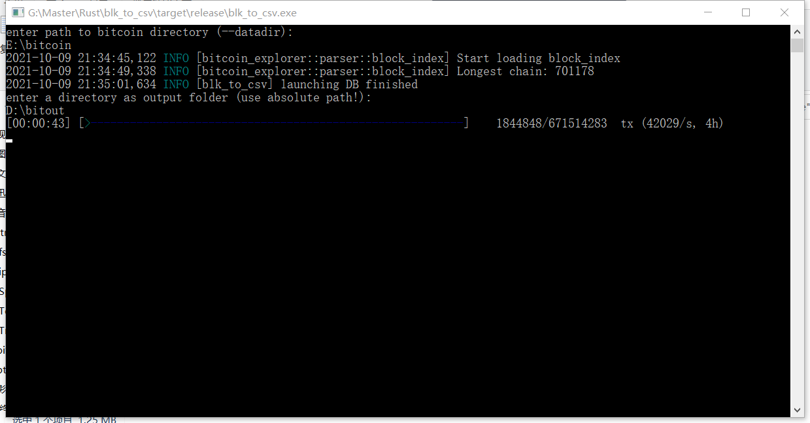

# Block to CSV

Export blockchain transactions to outputs.csv and inputs.csv using
[rusty-bitcoin-explorer](https://docs.rs/bitcoin-explorer/)

## Build

Requires rust toolchain and system build tools (VS on windows).
`cargo build --release`

## Usage

1. Double click to start the program.
2. Follow the instructions to enter the paths.
   - enter the path to bitcoin data dir 
   - enter the path to the folder where `input.csv` and `output.csv` will be saved
     (if the directory does not exist, it will be created). 

